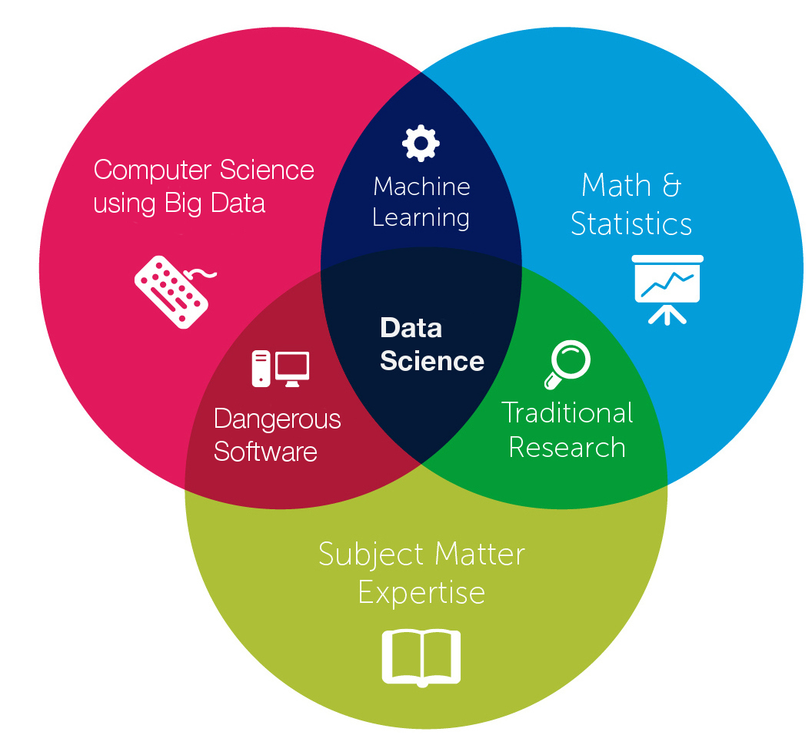

## Hello

👋 Hi, my name is Andy, come from Taiwan, with 2 years working experience as a data analyst

👀 I’m interested in Data Analytics and Data Science opportunities in the United States

🌱 I’m currently a Master Student major in Analytics at University of Southern California

💞️ I’m a highly responsible person who is also cooperative, meticulous, and innovative. Always eager to learn new things with considerable passion and curiosity. Based on my study and experiences in Data Analytics, I look forward to exploring more and applying what I have learned to business. No matter facing any challenges, I will be well prepared, adapt to new changes, and tackle them with an optimistic attitude.

📫 How to reach me: Email: wuchungm@usc.edu ; Linkedin: www.linkedin.com/in/chungmingwu

## KNN-With-Different-Metric

This is one of the HW assignment at USC, using KNN with different metrics to find the best test and train error.

1. Pre-Processing and Exploratory data analysis
2. k-nearest neighbors with Euclidean metric
3. Find a Learning Curve
4. KNN with different distance metrics
   - Manhattan Distance
   - Chebyshev Distance   
   - Mahalanobis Distance
5. Weighted distances

# Machine Learning for Data Science at University of Southern California

## HW1: Decision Tree

## HW2: K-means - GMM

## HW3: PCA-Fastmap

## HW4: Perceptron - Linear Regression - Logistic Regression

## HW5: Neural network

## HW6: SVM

## HW7: HMM

